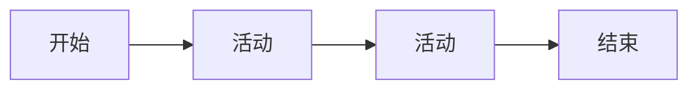
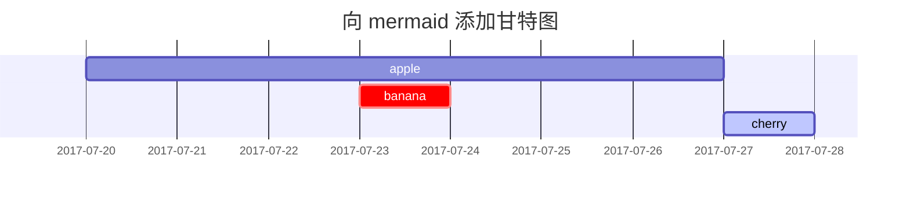

# 使用 Chirpy 主题搭建 GitHub Pages 博客

## 简介

GitHub Pages 是一个免费的静态网站托管服务，可以用来搭建项目主页、个人博客等静态网站。本文将详细介绍如何使用 Chirpy 主题搭建一个功能丰富的 GitHub Pages 博客。

## 准备工作

首先，需要一个GitHub账号，没有的话可以注册一个。

注册链接：[注册GitHub](https://github.com/join)

有一个GitHub账号非常方便，而且GitHub Pages是免费提供的。必须夸夸GitHub 赛博良人（虽然不及Cloudflare）

访问不了GitHub的，我后面会出文章解决。

## 开始搭建

### 1. 创建Chirpy主题仓库

推荐使用Chirpy-Starter方式。原因也很明显：好升级，简单，好用。

官网原文：
```
有两种方法可以为此主题创建新的存储库：

- [**使用 Chirpy Starter**](https://pansong291.github.io/chirpy-demo-zhCN/posts/getting-started/#方式一-使用-chirpy-starter) - 易于升级，隔离不相关的项目文件，以便您可以专注于写作。
- [**Forking on GitHub**](https://pansong291.github.io/chirpy-demo-zhCN/posts/getting-started/#方式二-forking-on-github) - 方便自定义开发，但难以升级。除非您熟悉 Jekyll 并决定对该项目做出调整或贡献，否则不建议使用此方法。
```


使用Chirpy-Starter作为模板，打开[Chirpy-Starter](https://github.com/cotes2020/chirpy-starter/generate)这个链接，会跳转到GitHub的新建仓库页面，创建一个新的仓库。

名字自己写，如果想使用GitHub Pages自己的域名，可以把仓库名改成`用户名.github.io`，这样GitHub Pages会自动为你生成域名。不设置也行，比如我已经为我的[ILoveScratch2.github.io](https://ilovescratch2.github.io)域名绑定了GitHub Pages并设置了自定义域名当成主页，如果已经有仓库了就会变成`用户名.github.io/仓库名`或者`域名/仓库名`。

我这里仓库名是`blog`，所以我的GitHub Pages的默认地址应该是`https://ilovescratch2.github.io/blog`(如果未设置自定义域名)。或者如果已经为`username.github.io`绑定了域名，那么应该是`https://域名/blog`。

其实这些后面都可以自定义。具体待会再说，也不多废话了。

Name自己写（设成主页并且用自带域名就是`你的用户名.github.io`。不用它当主页就自己考虑，没自定义域名并且用过`用户名.github.io`的可以也写成`blog`，这样就是`用户名.github.io/blog`了,有自定义域名如果想要是`域名/仓库名`的就自己考虑，自定义域名新建DNS记录的，比如`CNAME blog github.io。`就随便写，到时候设置域名的时候改就行了）

Owner选择自己的GitHub账号。

Description随便写，也可以不写，比如“我的博客”。

Repository Type最好选`Public`，`Private`没买GitHub Pro的是不能建设Pages的。而且`Public`也方便类似`giscus`这样的评论插件的使用。(其实也可以把评论存到别的仓库，但是我觉得这样不如一起方便)


点击`Create repository`按钮创建仓库，就创建好了仓库。如果卡在`Generating your repository`，刷新一下页面，应该就出来了。

### 2. 绑定域名（可选）

如果想绑定自己的域名，可以到GitHub Pages的设置里绑定。

如果你有占用了`用户名.github.io`的仓库，并且绑定了域名，默认就会作为你的域名，此时你自带的域名就会是`你曾经为用户名.github.io设置的域名/仓库名`。

首先，到域名服务商那里购买域名，比如腾讯云、阿里云、GoDaddy等，想必不用我教了，网上一堆教程。

然后，在域名服务商那里设置DNS记录，将域名指向GitHub Pages的IP地址。

比如，我的域名是`ilovescratch2.dpdns.org`，在腾讯云的DNS管理里，添加一条记录，记录类型选择`CNAME`，主机记录填`blog`，记录值填`github.io`保存。

如果你想把根域`@`指向你的博客，你就不能写`CNAME`记录了，而是添加一条`A`记录，记录值填`192.168.127.12`（GitHub Pages的IP地址），保存。


保存好了，过一段时间，你的域名应该就生效了。

但是仅仅这样是不够的，还需要在GitHub Pages的设置里设置自定义域名。

点击仓库的Settings，然后点击Pages，先在`Build and deployment` 下面的`Source`选择`GitHub Actions`，然后在`Custom domain`里填上你的域名，保存。

保存好了，过一段时间，你的自定义域名应该就生效了。

### 3. 配置Chirpy主题

仅仅把域名绑定到仓库是不行的，还需要配置使用，然后部署，才能看到博客。

一般情况下，创建完仓库后就会有一个`GitHub Actions`的工作流部署，但是大部分情况下这个第一次部署会失败，因为还没有配置好。

现在已经配置完域名了，我们需要配置Chirpy主题。

打开`Code`选项，打开`_config.yml`文件，点击编辑按钮，修改配置。


`lang: en`

`lang`默认是`en`，改成你想显示的语言，比如`zh-CN`是简体中文。(`lang: zh-CN`)


`timezone:`

`timezone`是时区，默认是`UTC`，我改成中国时区，比如`Asia/Shanghai`。
(`timezone: Asia/Shanghai`)


`title: Chirpy # the main title`

`title`是博客的标题，可以改成你想显示的标题。(`title: ILoveScratch Blog`，你也可以改成你想要的)


`tagline: A text-focused Jekyll theme # it will display as the subtitle`

`tagline`是博客的副标题，可以改成你想显示的副标题。(比如`tagline: 记录生活的点滴`)


`description: >- # used by seo meta and the atom feed
  A minimal, responsive and feature-rich Jekyll theme for technical writing.`

`description`是博客的描述，在搜索引擎或者FEED里可能会用到，可以改成你想显示的描述。(比如`description: 记录生活的点滴，分享技术、生活、感悟的博客`)


`url: ""`

`url`是博客的网址，默认是空的，如果绑定了自定义域名，就改成`https://域名`。(比如`url: "https://ilovescratch.dpdns.org"`，没有绑定自定义域名就改成`https://你的用户名.github.io`(注意不要在末尾加斜杠，而且必须是HTTPS，不然会被“没事找茬”的检查器报告不安全)

```yml
github:
  username: github_username # change to your GitHub username
```
`github`下的`username`是你的GitHub用户名，可以改成你自己的。

其他Twitter之类的也一样，但是这个一般不用设置（毕竟用Twitter的不多，配置方式和GitHub一样）

```yml
social:
  # Change to your full name.
  # It will be displayed as the default author of the posts and the copyright owner in the Footer
  name: your_full_name
  email: example@domain.com # change to your email address
  links:
    # The first element serves as the copyright owner's link
    - https://twitter.com/username # change to your Twitter homepage
    - https://github.com/username # change to your GitHub homepage
    # Uncomment below to add more social links
    # - https://www.facebook.com/username
    # - https://www.linkedin.com/in/username
```

这些配置拿翻译软件看看就知道什么意思
`name`是你的名字，可以改成你自己的。
`email`是你的邮箱，可以改成你自己的。
`links:`底下是你的链接，可以改成你自己的主页（如果有）或者社交媒体之类的。

预设了推特GitHub脸书领英的URL，自己取消注释（去掉`#`然后改成你的就行了）

比如这是我的配置（每个人都是不同的）
```yml
social:
  # Change to your full name.
  # It will be displayed as the default author of the posts and the copyright owner in the Footer
  name: ILoveScratch
  email: ilovescratch@foxmail.com # change to your email address
  links:
    # The first element serves as the copyright owner's link
    # - https://twitter.com/username # change to your Twitter homepage
    - https://github.com/ILoveScratch2 # change to your GitHub homepage
    # Uncomment below to add more social links
    # - https://www.facebook.com/username
    # - https://www.linkedin.com/in/username
```

然后是`webmaster`设置，用来给搜索引擎验证网站用的，暂时用不着

`analytics`设置，用来统计网站的访问量，比如`Google Analytics`之类的统计，暂时用不着

底下大部分都不用改，可以保留默认配置。

`theme_mode: # [light | dark]`

设置默认颜色模式是亮色还是暗色，默认跟随系统，大部分情况下不用改

`avatar:`

头像，可以替换成你自己的头像，写上图片URL就行了


有的后面会改，现在先改到这里
我现在的配置：（仅供参考）
```yaml
# The Site Configuration

# Import the theme
theme: jekyll-theme-chirpy

# The language of the webpage › http://www.lingoes.net/en/translator/langcode.htm
# If it has the same name as one of the files in folder `_data/locales`, the layout language will also be changed,
# otherwise, the layout language will use the default value of 'en'.
lang: zh-CN

# Change to your timezone › https://kevinnovak.github.io/Time-Zone-Picker
timezone: Asia/Shanghai

# jekyll-seo-tag settings › https://github.com/jekyll/jekyll-seo-tag/blob/master/docs/usage.md
# ↓ --------------------------

title: ILoveScratch Blog

tagline: Debug the world!

description: ILoveScratch的博客。记录各种实用软件，IT知识

# Fill in the protocol & hostname for your site.
# E.g. 'https://username.github.io', note that it does not end with a '/'.
url: "https://blog.ilovescratch.dpdns.org"

github:
  username: ILoveScratch2 # change to your GitHub username

twitter:
  username: twitter_username # change to your Twitter username

social:
  # Change to your full name.
  # It will be displayed as the default author of the posts and the copyright owner in the Footer
  name: ILoveScratch
  email: ilovescratch@foxmail.com # change to your email address
  links:
    # The first element serves as the copyright owner's link
    # - https://twitter.com/username # change to your Twitter homepage
    - https://github.com/ILoveScratch2 # change to your GitHub homepage
    # Uncomment below to add more social links
    # - https://www.facebook.com/username
    # - https://www.linkedin.com/in/username

# Site Verification Settings
webmaster_verifications:
  google: # fill in your Google verification code
  bing: # fill in your Bing verification code
  alexa: # fill in your Alexa verification code
  yandex: # fill in your Yandex verification code
  baidu: # fill in your Baidu verification code
  facebook: # fill in your Facebook verification code

# ↑ --------------------------
# The end of `jekyll-seo-tag` settings

# Web Analytics Settings
analytics:
  google:
    id: # fill in your Google Analytics ID
  goatcounter:
    id: # fill in your GoatCounter ID
  umami:
    id: # fill in your Umami ID
    domain: # fill in your Umami domain
  matomo:
    id: # fill in your Matomo ID
    domain: # fill in your Matomo domain
  cloudflare:
    id: # fill in your Cloudflare Web Analytics token
  fathom:
    id: # fill in your Fathom Site ID

# Page views settings
pageviews:
  provider: # now only supports 'goatcounter'

# Prefer color scheme setting.
#
# Note: Keep empty will follow the system prefer color by default,
# and there will be a toggle to switch the theme between dark and light
# on the bottom left of the sidebar.
#
# Available options:
#
#     light — Use the light color scheme
#     dark — Use the dark color scheme
#
theme_mode: # [light | dark]

# The CDN endpoint for media resources.
# Notice that once it is assigned, the CDN url
# will be added to all media resources (site avatar, posts' images, audio and video files) paths starting with '/'
#
# e.g. 'https://cdn.com'
cdn:

# the avatar on sidebar, support local or CORS resources
avatar: https://avatars.githubusercontent.com/u/161606492?v=4

# The URL of the site-wide social preview image used in SEO `og:image` meta tag.
# It can be overridden by a customized `page.image` in front matter.
social_preview_image: # string, local or CORS resources

# boolean type, the global switch for TOC in posts.
toc: true

comments:
  # Global switch for the post-comment system. Keeping it empty means disabled.
  provider: # [disqus | utterances | giscus]
  # The provider options are as follows:
  disqus:
    shortname: # fill with the Disqus shortname. › https://help.disqus.com/en/articles/1717111-what-s-a-shortname
  # utterances settings › https://utteranc.es/
  utterances:
    repo: # <gh-username>/<repo>
    issue_term: # < url | pathname | title | ...>
  # Giscus options › https://giscus.app
  giscus:
    repo: # <gh-username>/<repo>
    repo_id:
    category:
    category_id:
    mapping: # optional, default to 'pathname'
    strict: # optional, default to '0'
    input_position: # optional, default to 'bottom'
    lang: # optional, default to the value of `site.lang`
    reactions_enabled: # optional, default to the value of `1`

# Self-hosted static assets, optional › https://github.com/cotes2020/chirpy-static-assets
assets:
  self_host:
    enabled: # boolean, keep empty means false
    # specify the Jekyll environment, empty means both
    # only works if `assets.self_host.enabled` is 'true'
    env: # [development | production]

pwa:
  enabled: true # The option for PWA feature (installable)
  cache:
    enabled: true # The option for PWA offline cache
    # Paths defined here will be excluded from the PWA cache.
    # Usually its value is the `baseurl` of another website that
    # shares the same domain name as the current website.
    deny_paths:
      # - "/example"  # URLs match `<SITE_URL>/example/*` will not be cached by the PWA

paginate: 10

# The base URL of your site
baseurl: ""

# ------------ The following options are not recommended to be modified ------------------

kramdown:
  footnote_backlink: "&#8617;&#xfe0e;"
  syntax_highlighter: rouge
  syntax_highlighter_opts: # Rouge Options › https://github.com/jneen/rouge#full-options
    css_class: highlight
    # default_lang: console
    span:
      line_numbers: false
    block:
      line_numbers: true
      start_line: 1

collections:
  tabs:
    output: true
    sort_by: order

defaults:
  - scope:
      path: "" # An empty string here means all files in the project
      type: posts
    values:
      layout: post
      comments: true # Enable comments in posts.
      toc: true # Display TOC column in posts.
      # DO NOT modify the following parameter unless you are confident enough
      # to update the code of all other post links in this project.
      permalink: /posts/:title/
  - scope:
      path: _drafts
    values:
      comments: false
  - scope:
      path: ""
      type: tabs # see `site.collections`
    values:
      layout: page
      permalink: /:title/

sass:
  style: compressed

compress_html:
  clippings: all
  comments: all
  endings: all
  profile: false
  blanklines: false
  ignore:
    envs: [development]

exclude:
  - "*.gem"
  - "*.gemspec"
  - docs
  - tools
  - README.md
  - LICENSE
  - purgecss.js
  - rollup.config.js
  - "package*.json"

jekyll-archives:
  enabled: [categories, tags]
  layouts:
    category: category
    tag: tag
  permalinks:
    tag: /tags/:name/
    category: /categories/:name/
```


设置完之后点右上角的`Commit changes`，再点一次`Commit changes`保存就可以了。


然后还要配置个人介绍

打开存放博客的仓库，打开`_tabs`文件夹，点击仓库的`Add file`，在下拉菜单里点击`Create a new file`按钮，在顶部的路径输入`about.md`

然后使用Markdown格式写下你的个人介绍，如果你已经有主页了也可以写前往主页的链接

比如我的个人介绍：

```md

[我的主页](https://ilovescratch.dpdns.org)

Hello! 我是ILoveScratch，一名程序爱好者，热爱编程，喜欢分享，希望通过自己的努力帮助更多的人。

你可以通过以下方式联系到我：

- [GitHub](https://github.com/ILoveScratch2)
- [Email](mailto:ilovescratch@foxmail.com)

欢迎Fork、Star、Follow我！

```


### 4. 测试

`Commit`之后，GitHub Actions就会自动部署，大概需要3分钟左右，部署完成后，就可以访问你的博客了。

打开你设置的网址（比如`https://你的域名/blog`如果你已经为别的页面创建`用户名.github.io`并且绑定了域名，或者`https://你的域名`如果你单独绑定，或者`https://你的用户名.github.io/`如果你将仓库名设为`用户名.github.io`），如果看到下面这个页面，说明部署成功。


### 5. 写第一篇Blog来测试

现在，你已经成功部署了博客，可以开始写博客了。

打开存放博客的仓库，打开`_posts`文件夹，创建新的文件，在顶部的路径输入`2025-01-01-Test.md`

存放博客的Markdown必须是`年年年年-月月-日日-简短标题.md`

这是头部的信息，每个文章都必须有，在这个头信息最后的`---`后面写正文

```yaml
---
title: TITLE
date: YYYY-MM-DD HH:MM:SS +/-TTTT 
categories: [TOP_CATEGORIE, SUB_CATEGORIE]
tags: [TAG]
```

以上是每个文章都必须有的头部信息
以下是常见可选项


```yaml
---
title: TITLE
date: YYYY-MM-DD HH:MM:SS +/-TTTT 
categories: [TOP_CATEGORIE, SUB_CATEGORIE]
description: DESCRIPTION # 介绍，不设置截取正文，可以完全删除这一行
math: true  # 数学公式渲染，可以完全删除这一行
comments: true  # 允许评论，不设置默认开启，可以完全删除这一行
mermaid: true  # 渲染mermaid图表，可以完全删除这一行
image: /PATH/TO/IMAGE # 文章配图，可以完全删除这一行
tags: [TAG]
---
```
简单介绍一下：

`date`：博客的创建日期，其实可以自己写，什么时候都行，只是展示

格式是`年年年年-月月-日日 时时:分分:秒秒 +/-UTC时区`，比如`2025-01-01 12:00:00 +0800`，就是2025年1月1日12:00:00，北京时间（UTC+8）这样的格式

`title`：博客的标题，可以随便写，必须有

`categories`：博客的分类，可以有多个，比如`Technology`、`Life`、`Travel`等等，可以自己定义，也可以按照自己的理解来分类，必须有

`tags`：博客的标签，可以有多个，比如`Python`、`Java`、`C++`等等，可以自己定义，也可以按照自己的理解来分类，必须有

`description`：博客的描述，可以自己写，可以是一句话，也可以是一段话。也可以删除这一行，不写会截取正文

默认不渲染数学公式，比如LaTex，需要可以在头部加上`mathjax: true`来开启数学公式渲染。

`comments`：是否开启评论功能，现在暂时没用，下文会配置评论功能。默认所有文章都开启评论功能。如果不写就默认开启。你可以写`false`来单独为这一篇文章关闭评论功能。

`mermaid`：是否渲染mermaid图表，开启后`mermaid`代码块会被渲染成图表，默认不开启。

`math`：是否渲染数学公式，开启后Markdown中的数学公式（如LaTex）代码块会被渲染成数学公式，默认不开启。

`image`：文章配图，可以删除这一行，不写会没有文章介绍的配图，推荐写

正文部分，可以用Markdown语法来写，比如加粗、斜体、标题、列表、引用、代码块、图片、链接等等。


现在，可以开始写正文了


我准备了一段测试内容：

包括头部的信息，所以这个文章你可以完全复制这一篇

``````md

---
title: 测试博客
date: 2025-01-01 12:00:00 +0800
categories: [测试]
tags: [testing]
description: 这是一篇测试博客，用于测试网站的各种功能
math: true
---


# Markdown 渲染测试文档

## 1. 标题测试
# 1标题
## 2标题
### 3标题
#### 4标题
##### 5标题
###### 6标题

## 2. 文本格式测试
**加粗文本**  
*斜体文本*  
~~删除线文本~~  
***加粗斜体组合***  
普通段落文本，测试换行和空格是否正常显示，比如  多个空格  和  
软换行测试（行尾两个空格）

## 3. 列表测试

### 无序列表
- 一级项目
  - 二级嵌套
    - 三级嵌套
- 不同符号测试
  * 星号项目
  + 加号项目

### 有序列表
1. 第一项
2. 第二项
   1. 嵌套有序项
   2. 嵌套有序项
3. 第三项

## 4. 链接与图片
[普通链接](https://example.com)  
  


带解释的图片：

## 5. 引用块
> 一级引用文本
>> 二级嵌套引用
>>> 三级嵌套引用


## 6. 代码块测试

### 单行代码
`console.log("Hello World");`

### 多行代码
```python
def fibonacci(n):
    a, b = 0, 1
    for _ in range(n):
        yield a
        a, b = b, a + b
```

```javascript
function add(a, b) {
    return a + b;
}
```


```java
public class Main {
    public static void main(String[] args) {
        System.out.println("Hello Java");
    }
}
```

```go
package main
import "fmt"
func main() {
    fmt.Println("Hello Go")
}
```

```bash
#!/bin/bash
echo "Hello Shell"
```

## 7. 表格测试

| 表头1 | 表头2 | 表头3 |   
|-------|-------|-------|
| 单元格 | 单元格 | 单元格 |
| 单元格 | 单元格 | 单元格 |


| 左对齐 | 居中对齐 | 右对齐 |
| :------ | :------: | ------: |
| 单元格1 | 单元格2 | 单元格3 |
| 长文本测试 | `代码内联` | **加粗文本** |


## 8. HTML 嵌入测试

远程HTML内容
<iframe frameborder="no" border="0" marginwidth="0" marginheight="0" width=330 height=86 src="//music.163.com/outchain/player?type=2&id=28575553&auto=1&height=66"></iframe>

<iframe src="//player.bilibili.com/player.html?bvid=BV1DXPQeAEVG" scrolling="no" border="0" frameborder="no" framespacing="0" allowfullscreen="true"></iframe>

Markdown 内含 HTML 内容：

<div style="background-color: #f2f2f2; padding: 10px;">
  <p>这是一个 Markdown 内含 HTML 内容的测试。</p>
  <p>HTML 代码：<code>&lt;div style="background-color: #f2f2f2; padding: 10px;"&gt; &lt;p&gt;这是一个 Markdown 内含 HTML 内容的测试。&lt;/p&gt; &lt;/div&gt;</code></p>
</div>

## 9. 分割线测试

Hello
---
Hello

## 10. 数学公式测试
行内公式：$E = mc^2$

块级公式：
$$
\sum_{i=1}^{n} i = \frac{n(n+1)}{2}
$$

# 11. Mermaid 流程图测试



# 其他测试（摘自文档）
### 使用 html 标签

```markdown
<h2>H2 标题</h2>
```

### 不出现在右侧目录栏中

```markdown
<h3 data-toc-skip>H3 标题</h3>
```

### 自定义标题编号 {#custom-id}

例如上面这个标题。

```markdown
### 自定义标题编号 {#custom-id}
```
---

## 分割线
```markdown
---
```
---

## 段落

房祖名涉毒被捕后，身为禁毒宣传大使的成龙大哥到了拘留所，看到自己儿子二话不说上去就是一顿暴打。大哥的功夫真了得，几个警察愣是没拦住，打了十分钟，最后一脚踹到角落里。好家伙，足足踹飞 5 米远，这时一个角落里传来一声：“爸，你打张默干嘛？”。 <br>
张国立听说了以后十分恼火，这能行？跑到拘留所揪住房祖名结结实实一顿胖揍，这时一个角落传来一声：“叔，你再打张默就死了……”

Quisque egestas convallis ipsum, ut sollicitudin risus tincidunt a. Maecenas interdum malesuada egestas. Duis consectetur porta risus, sit amet vulputate urna facilisis ac. Phasellus semper dui non purus ultrices sodales. Aliquam ante lorem, ornare a feugiat ac, finibus nec mauris. Vivamus ut tristique nisi. Sed vel leo vulputate, efficitur risus non, posuere mi. Nullam tincidunt bibendum rutrum. Proin commodo ornare sapien. Vivamus interdum diam sed sapien blandit, sit amet aliquam risus mattis. Nullam arcu turpis, mollis quis laoreet at, placerat id nibh. Suspendisse venenatis eros eros.

## 文本样式

`**这是粗体文本**` **这是粗体文本** <br>
`__This is bold text__` __This is bold text__ <br>
`*这是斜体文本*` *这是斜体文本* <br>
`_This is italic text_` _This is italic text_ <br>
`~~Strikethrough 删除线~~` ~~Strikethrough 删除线~~ <br>
使用 `<kbd> </kbd>` 显示按键 <kbd>Ctrl</kbd> + <kbd>⇧ Shift</kbd> + <kbd>↵ Enter</kbd> <br>
使用 `<b>` 可以实现 <b>加粗</b> 的效果 <br>
使用 `<i>` 可以实现 <i>斜体</i> 的效果 <br>
使用 `<em>` 表示 <em>强调</em> 的效果 <br>
使用 `<br>` 可以在同一段落内换行 <br>
使用 `<sup>` 做上标如 O<sup>2-</sup> <br>
使用 `<sub>` 做下标如 H<sub>2</sub>O

## 列表
---
### 有序列表

```markdown
1. 第一个
2. 第二个
3. 第三个
```

1. 第一个
2. 第二个
3. 第三个

### 无序列表

```markdown
- 章
  + 小节
    * 段落
```

- 章
  + 小节
    * 段落

### 待办列表

```markdown
- [ ] 工作项
  + [x] 步骤 1
  + [x] 步骤 2
  + [ ] 步骤 3
```

- [ ] 工作项
  + [x] 步骤 1
  + [x] 步骤 2
  + [ ] 步骤 3

### 描述列表

```markdown
太阳
: 地球环绕的恒星

月亮
: 地球的天然卫星，通过太阳反射光可见
```

太阳
: 地球环绕的恒星

月亮
: 地球的天然卫星，通过太阳反射光可见

---

## 引用块

```markdown
> 此行显示 _引用块_ 。
> > 嵌套一层
> > > 嵌套两层
```

> 此行显示 _引用块_ 。
> > 嵌套一层
> > > 嵌套两层

## 提示

```markdown
> 显示 `tip` 类型提示的例子。
{: .prompt-tip }

> 显示 `info` 类型提示的例子。
{: .prompt-info }

> 显示 `warning` 类型提示的例子。
{: .prompt-warning }

> 显示 `danger` 类型提示的例子。
{: .prompt-danger }
```

> 显示 `tip` 类型提示的例子。
{: .prompt-tip }

> 显示 `info` 类型提示的例子。
{: .prompt-info }

> 显示 `warning` 类型提示的例子。
{: .prompt-warning }

> 显示 `danger` 类型提示的例子。
{: .prompt-danger }

## 表格

```markdown
| 公司                         | 联系人            | 国家     |
|:-----------------------------|:-----------------|--------:|
| 阿尔弗雷德                    | 玛丽亚·安德斯      | 德国    |
| 岛屿贸易                      | 海伦·贝内特        | 英国    |
| 意大利食品杂志                 | 乔瓦尼·罗韦利      | 意大利  |
```

| 公司                         | 联系人            | 国家     |
|:-----------------------------|:-----------------|--------:|
| 阿尔弗雷德                    | 玛丽亚·安德斯      | 德国    |
| 岛屿贸易                      | 海伦·贝内特        | 英国    |
| 意大利食品杂志                 | 乔瓦尼·罗韦利      | 意大利  |

## 链接

```markdown
<http://127.0.0.1:4000>

[Chirpy](https://github.com/cotes2020/jekyll-theme-chirpy/)

[新窗口打开](./){: target="_blank"}
```

<http://127.0.0.1:4000>{: target="_self"}

[Chirpy](https://github.com/cotes2020/jekyll-theme-chirpy/){: target="_self"}

[新窗口打开](./){: target="_blank"}

## 脚注

```markdown
点击角标将会定位到脚注[^footnote]，这是另一个脚注[^fn-nth-2]。
```

点击角标将会定位到脚注[^footnote]，这是另一个脚注[^fn-nth-2]。

## 内联代码

```markdown
这是 `Inline Code` 的示例。
```

这是 `Inline Code` 的示例。

## 文件路径

```markdown
就像这样 `/path/to/the/file.extend`{: .filepath} 。
```

就像这样 `/path/to/the/file.extend`{: .filepath} 。

## 代码块
---
### 常规

````markdown
```
This is a common code snippet, without syntax highlight and line number.
```
````

```
This is a common code snippet, without syntax highlight and line number.
```

### 指定语言

````markdown
```bash
if [ $? -ne 0 ]; then
  echo "The command was not successful.";
  #do the needful / exit
fi;
```
````

```bash
if [ $? -ne 0 ]; then
  echo "The command was not successful.";
  #do the needful / exit
fi;
```

### 指定文件名

````markdown
```sass
@import
  "colors/light-typography",
  "colors/dark-typography"
```
{: file='_sass/jekyll-theme-chirpy.scss'}
````

```sass
@import
  "colors/light-typography",
  "colors/dark-typography"
```
{: file='_sass/jekyll-theme-chirpy.scss'}

---

## 数学

```markdown
$$ \sum_{n=1}^\infty 1/n^2 = \frac{\pi^2}{6} $$

当 $a \ne 0$ 时， $ax^2 + bx + c = 0$ 有两个解，它们是

$$ x = {-b \pm \sqrt{b^2-4ac} \over 2a} $$
```

$$ \sum_{n=1}^\infty 1/n^2 = \frac{\pi^2}{6} $$

当 $a \ne 0$ 时， $ax^2 + bx + c = 0$ 有两个解，它们是

$$ x = {-b \pm \sqrt{b^2-4ac} \over 2a} $$

## Mermaid SVG

````markdown

````


## 图片
---
### 默认（带标题）

```markdown
{: width="972" height="589" }
_全屏宽度且居中对齐_
```

{: width="972" height="589" }
_全屏宽度且居中对齐_

### 左对齐

```markdown
{: width="972" height="589" .w-75 .normal}
```

{: width="972" height="589" .w-75 .normal}

### 向左浮动

```markdown
{: width="972" height="589" .w-50 .left}
```

{: width="972" height="589" .w-50 .left}
Praesent maximus aliquam sapien. Sed vel neque in dolor pulvinar auctor. Maecenas pharetra, sem sit amet interdum posuere, tellus lacus eleifend magna, ac lobortis felis ipsum id sapien. Proin ornare rutrum metus, ac convallis diam volutpat sit amet. Phasellus volutpat, elit sit amet tincidunt mollis, felis mi scelerisque mauris, ut facilisis leo magna accumsan sapien. In rutrum vehicula nisl eget tempor. Nullam maximus ullamcorper libero non maximus. Integer ultricies velit id convallis varius. Praesent eu nisl eu urna finibus ultrices id nec ex. Mauris ac mattis quam. Fusce aliquam est nec sapien bibendum, vitae malesuada ligula condimentum.

### 向右浮动

```markdown
{: width="972" height="589" .w-50 .right}
```

{: width="972" height="589" .w-50 .right}
Praesent maximus aliquam sapien. Sed vel neque in dolor pulvinar auctor. Maecenas pharetra, sem sit amet interdum posuere, tellus lacus eleifend magna, ac lobortis felis ipsum id sapien. Proin ornare rutrum metus, ac convallis diam volutpat sit amet. Phasellus volutpat, elit sit amet tincidunt mollis, felis mi scelerisque mauris, ut facilisis leo magna accumsan sapien. In rutrum vehicula nisl eget tempor. Nullam maximus ullamcorper libero non maximus. Integer ultricies velit id convallis varius. Praesent eu nisl eu urna finibus ultrices id nec ex. Mauris ac mattis quam. Fusce aliquam est nec sapien bibendum, vitae malesuada ligula condimentum.

### 深色/浅色模式和阴影

```markdown
下图将根据主题偏好切换深色/浅色模式，请注意它有阴影。

{: .light .w-75 .shadow .rounded-10 w='1212' h='668' }
{: .dark .w-75 .shadow .rounded-10 w='1212' h='668' }
```

下图将根据主题偏好切换深色/浅色模式，请注意它有阴影。

{: .light .w-75 .shadow .rounded-10 w='1212' h='668' }
{: .dark .w-75 .shadow .rounded-10 w='1212' h='668' }

---

## 视频


```markdown

```




## 反向脚注

```markdown
[^footnote]: 脚注源
[^fn-nth-2]: 第二个脚注源
```

[^footnote]: 脚注源
[^fn-nth-2]: 第二个脚注源
``````

点击`Commit changes`提交，然后等待几分钟打开网站

欸？怎么没看到博客内容？

因为Chirpy主题新版注册了 `Service Worker`，可以缓存网页内容（有时某些`VPN`网站被屏蔽或者你断网的时候访问会显示定制无法访问页面也是这个原理），缓存了内容。所以你可以清除网站缓存或者打开网站然后加载完成等一小会，会弹一个`A new  version of content is available`或`有新版本内容可用`的提示，然后点击弹窗的蓝色加载按钮就可以了。

如果一直没有，可以打开一个无痕模式或者InPrivate模式的浏览器访问，或者清除网站缓存，就可以了。

如果还是不行，可以尝试重新部署博客，或者联系我，我可以免费帮你排查问题。

### 6. 细节配置

#### 6.1 无用的社交按钮

页面左下角默认有几个按钮，配置方法在`_config.yml`文件中，上文已经讲过了

默认会有一个“Twitter/X”的按钮，但是你未必需要这些按钮。默认的社交按钮可以删掉，或者改成你自己的，比如：

打开仓库的`_data/contact.yml`文件，可以看到社交按钮的配置:

```yaml
#  The contact options.

- type: github
  icon: "fab fa-github"

- type: twitter
  icon: "fa-brands fa-x-twitter"

- type: email
  icon: "fas fa-envelope"
  noblank: true # open link in current tab

- type: rss
  icon: "fas fa-rss"
  noblank: true
# Uncomment and complete the url below to enable more contact options
#
# - type: mastodon
#   icon: 'fab fa-mastodon'   # icons powered by <https://fontawesome.com/>
#   url:  ''                  # Fill with your Mastodon account page, rel="me" will be applied for verification
#
# - type: linkedin
#   icon: 'fab fa-linkedin'   # icons powered by <https://fontawesome.com/>
#   url:  ''                  # Fill with your Linkedin homepage
#
# - type: stack-overflow
#   icon: 'fab fa-stack-overflow'
#   url:  ''                  # Fill with your stackoverflow homepage
#
# - type: bluesky
#   icon: 'fa-brands fa-bluesky'
#   url: ''                   # Fill with your Bluesky profile link
#
# - type: reddit
#   icon: 'fa-brands fa-reddit'
#   url: ''                   # Fill with your Reddit profile link
#
# - type: threads
#   icon: 'fa-brands fa-threads'
#   url: ''                   # Fill with your Threads profile link
```

可以自己修改，比如我把`twitter`按钮删掉了,就注释掉：

```yaml
# - type: twitter
#   icon: "fa-brands fa-x-twitter"
```

其他如Email,RSS，LinkedIn等都可以配置，默认删除的按钮可以自己添加


#### 6.2 侧边栏

侧边栏有`首页·归档·标签·分类·关于`五个选项。

我认为没有问题，如果你想删除或加入新的选项，可以修改`_tabs`目录里的内容

比如这是`归档`:
```yaml
---
layout: archives
icon: fas fa-archive
order: 3
---
```

`icon`是图标，`order`是排序，数字越小越靠前。可以修改这些文件来改变侧边栏的显示。

想新建侧边栏选项，可以复制已有的文件，然后修改文件名和内容。
比如:
```yaml
---
layout: TEST
icon: fas fa-tree
order: 2
---
```
就能创建一个新的`TEST`选项，内容为空，图标是树，排序是2(需要修改别的选项的排序避免冲突)。

在`_layouts`里可以配置，比如创建一个`TEST.html`文件，内容如下:
```html
---
layout: Page
---
<p>这是测试页面</p>
```

这样就可以在侧边栏显示一个`TEST`选项，点击后显示`TEST.html`页面。
可配置的很多，可以慢慢探索。

#### 6.3 图标

网站默认图标是一只蚂蚁，很不好看。

可以使用[Favocon Generator](https://realfavicongenerator.net/)，替换掉`assets/img/favicons/`目录的内容。

详见[自定义图标 | Chirpy CN](https://pansong291.github.io/chirpy-demo-zhCN/posts/customize-the-favicon/)

#### 6.4 多作者

文章的作者信息存放在`_data/authors.yml`，可填写多个作者。

比如：

```yaml
ILoveScratch:
  name: ILoveScratch
  url: https://github.com/ILoveScratch2/
```

在文章头部指定作者：

```yaml
---
title: TITLE
date: YYYY-MM-DD HH:MM:SS +/-TTTT 
categories: [TOP_CATEGORIE, SUB_CATEGORIE]
tags: [TAG]
author: ILoveScratch
---
```
#### 6.5 分享

文章的分享信息存放在`_data/share.yml`，可以修改分享按钮。

比如：

```yaml
platforms:
  - type: Twitter
    icon: "fa-brands fa-square-x-twitter"
    link: "https://twitter.com/intent/tweet?text=TITLE&url=URL"
```

#### 6.6 评论

评论功能默认开启，如果不需要，可以在文章头部加上`comments: false`关闭。

评论功能我推荐`giscus`，可以直接在GitHub Pages上使用，不需要额外服务器。

配置方法：
1. 打开你的仓库，打开`Settings` -> `General`(默认打开就是这个页面) 底部打开 
2. 打开[giscus App](https://github.com/apps/giscus)
3. 点击`Install`，选择存放仓库的账户，选择`All repositories`最方便，也可以`Only select repositories`选择你需要的仓库(博客的仓库)
4. 安装完后，打开[giscus](https://giscus.app/)
5. 往下滑，仓库输入`用户名/放置博客的仓库名`如`ILoveScratch/blog`(其实也可以将评论放在别的仓库，但是直接放在博客仓库更方便)
6. 往下滑，选择`Category`选择`General`这样谁都可以发表
7. 往下滑，可以看到类似这样的配置：

```html
<script src="https://giscus.app/client.js"
        data-repo="ILoveScratch2/blog"
        data-repo-id="R_kgDON3PU6w"
        data-category="General"
        data-category-id="DIC_kwDON3PU684Cm-4O"
        data-mapping="pathname"
        data-strict="0"
        data-reactions-enabled="1"
        data-emit-metadata="0"
        data-input-position="bottom"
        data-theme="preferred_color_scheme"
        data-lang="zh-CN"
        crossorigin="anonymous"
        async>
</script>
```
打开`_config.yml`文件，找到`comments`选项。

将`provider`设为`giscus`，将`giscus`下的`repo`, `repo_id`, `category`, `category_id`改成你自己的配置。

这是我的（每个仓库都是不一样的，请自行修改，不能复制，仅供参考）
```yaml
comments:
  # Global switch for the post-comment system. Keeping it empty means disabled.
  provider: giscus
  # The provider options are as follows:
  disqus:
    shortname: # fill with the Disqus shortname. › https://help.disqus.com/en/articles/1717111-what-s-a-shortname
  # utterances settings › https://utteranc.es/
  utterances:
    repo: # <gh-username>/<repo>
    issue_term: # < url | pathname | title | ...>
  # Giscus options › https://giscus.app
  giscus:
    repo: "ILoveScratch2/blog"
    repo_id: "R_kgDON3PU6w"
    category: "General"
    category_id: "DIC_kwDON3PU684Cm-4O"
    mapping: # optional, default to 'pathname'
    strict: # optional, default to '0'
    input_position: # optional, default to 'bottom'
    lang: # optional, default to the value of `site.lang`
    reactions_enabled: # optional, default to the value of `1`
```

#### 6.7 统计

统计默认关闭，如果需要，可以在`_config.yml`文件中找到`analytics`选项，将`google_analytics`改成你的统计代码。

#### 6.8 其他

其他配置可以参考`_config.yml`文件，里面有详细的注释。


### 7. FINISH!

恭喜你，博客已经部署成功！

如果有任何问题，欢迎在评论区提问。

最后放上我的完整`_config.yml`文件供参考(只能参考，放到别的地方可能会有问题)：

```yaml
# The Site Configuration

# Import the theme
theme: jekyll-theme-chirpy

# The language of the webpage › http://www.lingoes.net/en/translator/langcode.htm
# If it has the same name as one of the files in folder `_data/locales`, the layout language will also be changed,
# otherwise, the layout language will use the default value of 'en'.
lang: zh-CN

# Change to your timezone › https://kevinnovak.github.io/Time-Zone-Picker
timezone: Asia/Shanghai

# jekyll-seo-tag settings › https://github.com/jekyll/jekyll-seo-tag/blob/master/docs/usage.md
# ↓ --------------------------

title: ILoveScratch Blog

tagline: Debug the world!

description: ILoveScratch的博客。记录各种实用软件，IT知识

# Fill in the protocol & hostname for your site.
# E.g. 'https://username.github.io', note that it does not end with a '/'.
url: "https://blog.ilovescratch.dpdns.org"

github:
  username: ILoveScratch2 # change to your GitHub username

twitter:
  username: twitter_username # change to your Twitter username

social:
  # Change to your full name.
  # It will be displayed as the default author of the posts and the copyright owner in the Footer
  name: ILoveScratch
  email: ilovescratch@foxmail.com # change to your email address
  links:
    # The first element serves as the copyright owner's link
    # - https://twitter.com/username # change to your Twitter homepage
    - https://github.com/ILoveScratch2 # change to your GitHub homepage
    # Uncomment below to add more social links
    # - https://www.facebook.com/username
    # - https://www.linkedin.com/in/username

# Site Verification Settings
webmaster_verifications:
  google: # fill in your Google verification code
  bing: # fill in your Bing verification code
  alexa: # fill in your Alexa verification code
  yandex: # fill in your Yandex verification code
  baidu: # fill in your Baidu verification code
  facebook: # fill in your Facebook verification code

# ↑ --------------------------
# The end of `jekyll-seo-tag` settings

# Web Analytics Settings
analytics:
  google:
    id: # fill in your Google Analytics ID
  goatcounter:
    id: # fill in your GoatCounter ID
  umami:
    id: # fill in your Umami ID
    domain: # fill in your Umami domain
  matomo:
    id: # fill in your Matomo ID
    domain: # fill in your Matomo domain
  cloudflare:
    id: # fill in your Cloudflare Web Analytics token
  fathom:
    id: # fill in your Fathom Site ID

# Page views settings
pageviews:
  provider: # now only supports 'goatcounter'

# Prefer color scheme setting.
#
# Note: Keep empty will follow the system prefer color by default,
# and there will be a toggle to switch the theme between dark and light
# on the bottom left of the sidebar.
#
# Available options:
#
#     light — Use the light color scheme
#     dark — Use the dark color scheme
#
theme_mode: # [light | dark]

# The CDN endpoint for media resources.
# Notice that once it is assigned, the CDN url
# will be added to all media resources (site avatar, posts' images, audio and video files) paths starting with '/'
#
# e.g. 'https://cdn.com'
cdn:

# the avatar on sidebar, support local or CORS resources
avatar: https://avatars.githubusercontent.com/u/161606492?v=4

# The URL of the site-wide social preview image used in SEO `og:image` meta tag.
# It can be overridden by a customized `page.image` in front matter.
social_preview_image: # string, local or CORS resources

# boolean type, the global switch for TOC in posts.
toc: true

comments:
  # Global switch for the post-comment system. Keeping it empty means disabled.
  provider: giscus
  # The provider options are as follows:
  disqus:
    shortname: # fill with the Disqus shortname. › https://help.disqus.com/en/articles/1717111-what-s-a-shortname
  # utterances settings › https://utteranc.es/
  utterances:
    repo: # <gh-username>/<repo>
    issue_term: # < url | pathname | title | ...>
  # Giscus options › https://giscus.app
  giscus:
    repo: "ILoveScratch2/blog"
    repo_id: "R_kgDON3PU6w"
    category: "General"
    category_id: "DIC_kwDON3PU684Cm-4O"
    mapping: # optional, default to 'pathname'
    strict: # optional, default to '0'
    input_position: # optional, default to 'bottom'
    lang: # optional, default to the value of `site.lang`
    reactions_enabled: # optional, default to the value of `1`

# Self-hosted static assets, optional › https://github.com/cotes2020/chirpy-static-assets
assets:
  self_host:
    enabled: # boolean, keep empty means false
    # specify the Jekyll environment, empty means both
    # only works if `assets.self_host.enabled` is 'true'
    env: # [development | production]

pwa:
  enabled: true # The option for PWA feature (installable)
  cache:
    enabled: true # The option for PWA offline cache
    # Paths defined here will be excluded from the PWA cache.
    # Usually its value is the `baseurl` of another website that
    # shares the same domain name as the current website.
    deny_paths:
      # - "/example"  # URLs match `<SITE_URL>/example/*` will not be cached by the PWA

paginate: 10

# The base URL of your site
baseurl: ""

# ------------ The following options are not recommended to be modified ------------------

kramdown:
  footnote_backlink: "&#8617;&#xfe0e;"
  syntax_highlighter: rouge
  syntax_highlighter_opts: # Rouge Options › https://github.com/jneen/rouge#full-options
    css_class: highlight
    # default_lang: console
    span:
      line_numbers: false
    block:
      line_numbers: true
      start_line: 1

collections:
  tabs:
    output: true
    sort_by: order

defaults:
  - scope:
      path: "" # An empty string here means all files in the project
      type: posts
    values:
      layout: post
      comments: true # Enable comments in posts.
      toc: true # Display TOC column in posts.
      # DO NOT modify the following parameter unless you are confident enough
      # to update the code of all other post links in this project.
      permalink: /posts/:title/
  - scope:
      path: _drafts
    values:
      comments: false
  - scope:
      path: ""
      type: tabs # see `site.collections`
    values:
      layout: page
      permalink: /:title/

sass:
  style: compressed

compress_html:
  clippings: all
  comments: all
  endings: all
  profile: false
  blanklines: false
  ignore:
    envs: [development]

exclude:
  - "*.gem"
  - "*.gemspec"
  - docs
  - tools
  - README.md
  - LICENSE
  - purgecss.js
  - rollup.config.js
  - "package*.json"

jekyll-archives:
  enabled: [categories, tags]
  layouts:
    category: category
    tag: tag
  permalinks:
    tag: /tags/:name/
    category: /categories/:name/
```

### 8. 本地部署/预览

#### 安装 Ruby

1. 在 [官网](https://rubyinstaller.org/downloads/) 下载最新版 WITH DEVKIT 的 Ruby。
  
2. 下载完毕打开 ridk install，在跳出的 CMD 中输入 3（选择`MSYS2 and MINGW development tool chain`），安装 gem 扩展。
  

#### 安装 Jekyll

1. 打开 CMD，安装 Jekyll
  
  ` gem install jekyll bundler`
  
2. 查看是否成功安装
  
  `jekyll -v`

#### 克隆博客仓库

打开 CMD，进入你想存放博客的目录
```
git clone https://github.com/你的用户名/你的仓库.git
```

#### 安装依赖

进入博客目录
```
cd 你的仓库
```
安装依赖
```
bundle
```

如果太慢可以参考[使用国内源加速 RubyGems 安装](https://blog.ilovescratch.dpdns.org/posts/use-china-rubygems-mirror/)

#### 运行博客

运行博客
```
bundle exec jekyll s
```
运行后打开浏览器，访问`http://localhost:4000`

需要注意的是，本地预览和实际部署效果不完全一致。

